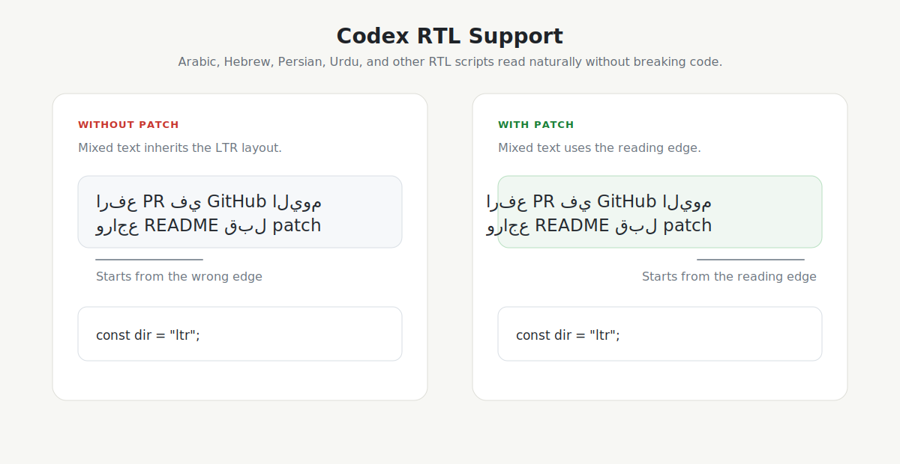

# Codex RTL Support

Right-to-left text support for the Codex macOS desktop app.

[](https://github.com/SaudNull/codex-rtl-support/actions/workflows/ci.yml)



Codex is excellent for Arabic, Hebrew, Persian, Urdu, and other RTL conversations, but the desktop UI can render RTL text inside an LTR flow. This patch adds a small runtime layer that detects the first strong character in chat and composer text, applies the correct `dir`, and leaves code-oriented surfaces alone.

## What It Fixes

- Arabic, Hebrew, Persian, Urdu, and other RTL messages start from the correct side.
- Mixed RTL/LTR text uses browser-native bidi behavior with `unicode-bidi: plaintext`.
- Composer input updates direction while you type.
- Code blocks, diffs, terminal output, file paths, and editor-like surfaces stay left-to-right.

## Demo

Open `docs/demo.html` in a browser to see the same before/after behavior locally.

## Install

```bash
npm install
npm run patch
```

Quit Codex before installing. Reopen it after the installer finishes.

If macOS blocks writes to `/Applications/Codex.app`, run:

```bash
sudo env "PATH=$PATH" npm run patch
```

If it is still blocked, enable Terminal in:

System Settings -> Privacy & Security -> App Management

## Uninstall

```bash
npm run restore
```

This restores the `app.asar.codex-rtl-backup` created during install.

## Check

```bash
npm run status
npm test
npm run dry-run
```

Codex updates replace `app.asar`, so run `npm run patch` again after updating the app.

## How It Works

The installer extracts Codex's `app.asar`, injects two files into `webview/index.html`, rebuilds the archive, stores a backup, then re-signs the app bundle with an ad-hoc signature.

Runtime files:

- `assets/codex-rtl-support.js`
- `assets/codex-rtl-support.css`

Installer:

- `scripts/patch-codex.mjs`

## Supported App

This project targets the macOS desktop build of Codex installed at:

```text
/Applications/Codex.app
```

Use `--app` for another copy:

```bash
node scripts/patch-codex.mjs install --app "/path/to/Codex.app"
```

## Disclaimer

This is an independent community patch. It is not affiliated with OpenAI.
